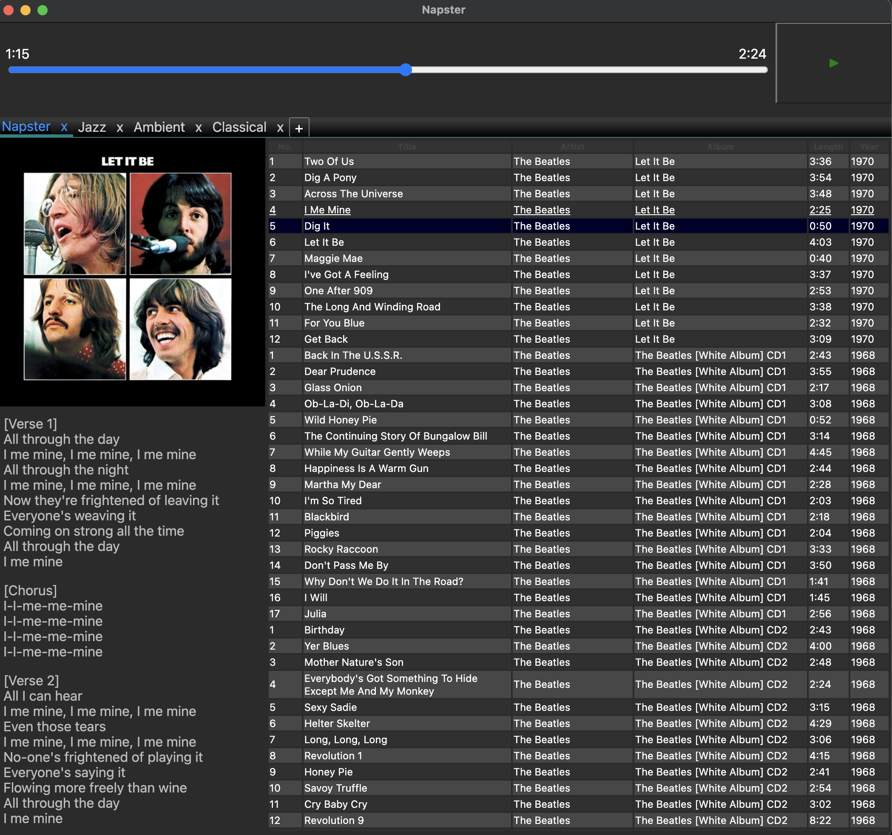

# Napster

An Electron media player that is built with Svelte.

### Why?

The players I have tried do not fulfill my needs. 

### Features

* Napster remembers your playlists, their order and the songs in them automatically. It's as easy as closing it and opening it again. 

* Add songs by dropping folders or files on a playlist.

* Rearrange songs with intuitive drag and drop. 

* Create playlists with tabs. Arrange tabs. Undo delete (CMD+T / CTRL+T). 

* Move songs between playlists by dragging the elements onto the tab titles. 

* Press CTRL+O on playlist items to open in Finder/File Explorer. 

* Play videos.

* As seen above lyrics and album cover is also retrieved which isn't part of the song file meta-data. This requires internet connection and only appears if it can be retrieved and when the player is expanded to a certain width. For now this is a locked feature. Unless people want to use this feature it requires a custom fix. Create a .env file and put your API access token from [Genius](https://docs.genius.com/). It should be named GENIUS_ACCESS_TOKEN=xxxxxxxxx

### Development

To get started: 

`npm i `

To start in development mode:

`npm run start-dev`

To build the player yourself:

`npm run dist`

To make it build for other OS add electron-builder configs for other OS. I have chosen not to add this to make the dist command faster. 

### Issues

Napster has not been tested on anything but MacOS. 

The intention has always been to make something for myself that fulfills my personal needs. But I also see value in open-sourcing the code for others.

Feel free to create an issue, though.
